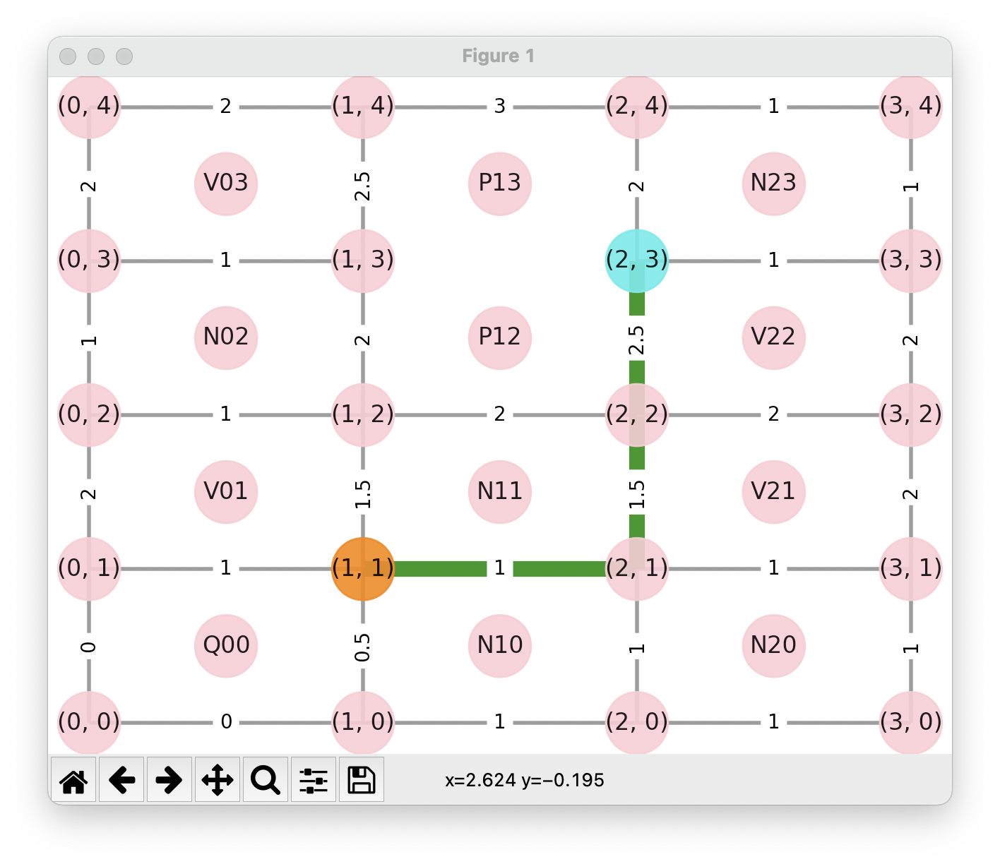
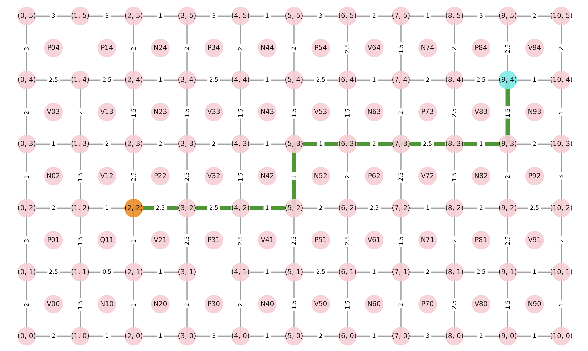
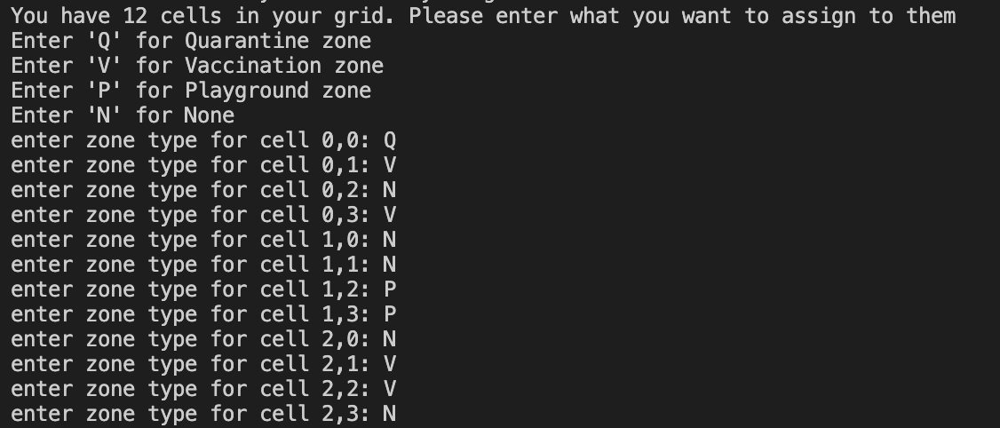
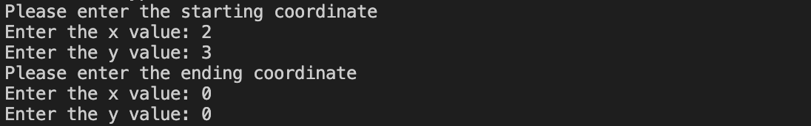
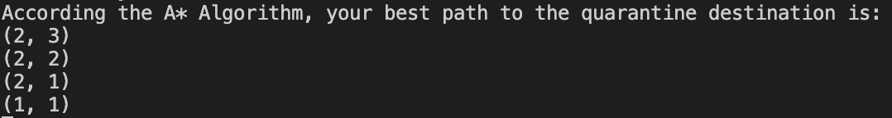

# A STAR ALGORITHM
Implemented the A* Algorithm to find the shortest path between 2 points.   
The A* Algorithm is similar to Dijikstra's Algorithm. However, the A* Algorithm makes use of some sort of admissible heuristic function, so that each vertex in the graph knows how long it will take to get to the goal without visiting the vertex.

To demonstrate the algorithm, I created a grid map. The goal is this: The user is in a town and is infected with COVID-19. He needs to get home to quarantine. We make use of the A* Algorithm to find the shortest path to his home.

In the map, there are 4 types of buildings:
- Vaccination facility (V) - denoted as V12 for example
- Playground (P) - denoted as P5 for example
- None/Other (N) - denoted as N10 for example
- Home/Quarantine Place (Q) - denoted as Q1 for example
  
**Edges** = roads, each having a cost depending on what they connect  
**Vertices** = coordinates, if a user arrives at a coordinate that touches the quarantine place, he has arrived at his destination

Each road has a cost, if the road is between:
- 2 buildings of the same type, cost = 1
- Playground and Vaccination, cost = 2.5
- Playground and None/Other, cost = 2
- Playground and Quarantine, cost = 1.5
- Playground and Playground, INACCESSIBLE
- Vaccination and None/Other, cost = 1.5
- Vaccination and Quarantine, cost = 1
- Vaccination and Vaccination, cost = 2
- None/Other and Quarantine, cost = 0.5

## **Complex example**

## **Instructions**
- Before starting the program, make sure to activate the virtual environment in the terminal by the command: 
`source env/bin/activate`
 

- Then start the application by typing the path of the Main.py file in the terminal
 

- When you start the application, you enter the grid size you want: 

  

- Then the program will ask for what you want to place in the grid:

  

- Then the program will ask for the coordinates like (0,1) or (1,0):
Since it's role C, we assume that we only start in one of the corners so we can't enter non-corner coordinates

  

- Finally, the program will display the result:  

IN THE CONSOLE:

  
IN THE GUI:

**LEGEND FOR GUI:** 
Starting point = blue 
Ending point = orange 
AStar optimal path = green

## **Libraries**

- MatplotLib/Networkx for the GUI 
- Numpy 
